# MANDAT Hackathon Demo

In this demo, we showcase the initialisation of a business contract between the SME and the BANK in form of a credit
grant.
An overview of the current state is provided in Figure 1, where the starting point is indicated by step 0 "create
demand". You may follow the numeric ordering to get an idea of the flow.

Figure 1: The current state of the demo.

- The _Credit App_ is available at [/lisa/](/lisa/).
- The _Banking App_ is available at [/tom/](/tom/).
- The _Data App_ is available at [/max/](/max/).
- We use Solid Pods provided by
  a [Community Solid Server](https://github.com/CommunitySolidServer/CommunitySolidServer) (v5.0.0) instance.

Currently, the following sequence is showcased:

```mermaid
sequenceDiagram
actor Tom
participant KMU_Pod as SME_Pod
actor Lisa
participant Bank_Pod as BANK_Pod
actor Max 
participant StB_Pod as TAX_Pod



%% Anbahnung Partnerschaft

%% grant access to that resource to bank
note over Lisa,Bank_Pod: Make Demand Inbox publically available.
    Lisa->>+Bank_Pod: [HTTP PATCH /credits/demands/.acl] (grant public append)
    Bank_Pod-->>-Lisa: [HTTP 205 RESET CONTENT] location .acl

note over Tom,SME_Pod: Make data requests container available for Max.
    Tom->>+SME_Pod: [HTTP PATCH /data-requests/.acl] (grant Max read)
    SME_Pod-->>-Tom: [HTTP 205 RESET CONTENT] location .acl

note over Tom,StB_Pod: Initialising Business Contract

    %% (1) Anfrage Kreditvertrag
    note over Tom,Bank_Pod: (0) request credit grant

    %% create potential callback resource for TAX to patch data processed in
    Tom->>+KMU_Pod: [HTTP POST /data-processed/] (callback resource)
    KMU_Pod-->>-Tom: [HTTP 201 CREATED] location {uuid}

    %% grant write access to TAX and read access to bank
    Tom->>+KMU_Pod: [HTTP PATCH /data-processed/{uuid}.acl] (grant TAX write, BANK read)
    KMU_Pod-->>-Tom: [HTTP 205 RESET CONTENT] location {uuid}.acl

    %% create callback resource for bank to patch data request in
    Tom->>+KMU_Pod: [HTTP POST /data-requests/] (callback resource)
    KMU_Pod-->>-Tom: [HTTP 201 CREATED] location {uuid}

    %% grant write access to bank and read access to tax
    Tom->>+KMU_Pod: [HTTP PATCH /data-requests/{uuid}.acl] (grant BANK write, TAX read)
    KMU_Pod-->>-Tom: [HTTP 205 RESET CONTENT] location {uuid}.acl

    %% create credit demand in bank pod
    Tom->>+Bank_Pod: [HTTP POST /credits/demands/] credit demand
    Bank_Pod-->>-Tom: [HTTP 201 CREATED] location {uuid}


    note over Lisa,Bank_Pod: (1) process credit grant

    %% fetch credit demand
    Lisa->>+Bank_Pod: [HTTP GET /credits/demands/}]
    Bank_Pod-->>-Lisa: [HTTP 200 OK] credit demands
    Lisa->>+Bank_Pod: [HTTP GET /credits/demands/{uuid}]
    Bank_Pod-->>-Lisa: [HTTP 200 OK] credit demand

    %% grant access to that resource to KMU as they do not have access by default
    %% The following .acl patch is equivalent to acknowledging the demand. 
    %% Otherwise the demand may not exist at all.
    Lisa->>+Bank_Pod: [HTTP PATCH /credits/demands/{uuid}.acl] (grant SME read)
    Bank_Pod-->>-Lisa: [HTTP 205 RESET CONTENT] location {uuid}.acl

    %% process credit demand to decide what to do next
    opt 
        Lisa-)Lisa: processing
    end

    %% (2) Nachfrage aktuelle Unternehmenssituation
    note over Tom,Lisa: (2) request company data

    %% create data request, i.e., update the callback resource
    Lisa->>+KMU_Pod: [HTTP PATCH /data-requests/{uuid}] data request
    KMU_Pod-->>-Lisa: [HTTP 205 RESET CONTENT] location /data-requests/{uuid}

    %% (3) Anfrage Nachweis über Unternehmenssituation
    note over Tom,KMU_Pod: (.2) "forward" data request

    %% Notify TAX
    opt
        %% note over Lisa: This Notification does not contain the request, only a link to the request.
        Lisa->>+SME_Pod: [HTTP POST /inbox/] Linked Data Notification
        SME_Pod-->>-Lisa: [HTTP 201 Created] location /inbox/{uuid}
        Tom->>+SME_Pod: [HTTP GET /inbox/]
        SME_Pod-->>-Tom: [HTTP 200 OK] Inbox
        Tom->>+SME_Pod: [HTTP GET /inbox/{uuid}]
        SME_Pod-->>-Tom: [HTTP 200 OK] notification
        Tom->>+StB_Pod: [HTTP POST /inbox/] Linked Data Notification
        StB_Pod-->>-Tom: [HTTP 201 Created] location /inbox/{uuid}
    end

    note over KMU_Pod,StB_Pod: (3) process data request
    %% Notice the data request
    Max->>+StB_Pod: [HTTP GET /data-requests/]
    StB_Pod-->>-Max: [HTTP 200 OK] data request container
    Max->>+StB_Pod: [HTTP GET /data-requests/{uuid}]
    StB_Pod-->>-Max: [HTTP 200 OK] data request
    opt
        Max->>Max: processing
        Max->>StB_Pod: 
        Max->>KMU_Pod: 
        Max->>Max: 
    end
    %% provide data as reponse to data request, patching into the callback resource
    Max->>+KMU_Pod: [HTTP PATCH /data-processed/{uuid}] data processed
    KMU_Pod-->>-Max: [HTTP 205 RESET CONTENT] location {uuid}

    %% (4) Lieferung Nachweis
    note over Tom,KMU_Pod: (.access control) "forward" provided data
    %% Notify TAX
    opt
        %% note over Lisa: This Notification does not contain the data, only a link to the data.
        Max->>+SME_Pod: [HTTP POST /inbox/] Linked Data Notification
        SME_Pod-->>-Max: [HTTP 201 Created] location /inbox/{uuid}
        Tom->>+SME_Pod: [HTTP GET /inbox/]
        SME_Pod-->>-Tom: [HTTP 200 OK] Inbox
        Tom->>+SME_Pod: [HTTP GET /inbox/{uuid}]
        SME_Pod-->>-Tom: [HTTP 200 OK] notification
        Tom->>+Bank_Pod: [HTTP POST /inbox/] Linked Data Notification
        Bank_Pod-->>-Tom: [HTTP 201 Created] location /inbox/{uuid}
    end
    note over KMU_Pod,Lisa: (4,5) access and process provided data
    %% Notice the data provided
    Lisa->>+KMU_Pod: [HTTP GET /data-processed/{uuid}]
    KMU_Pod-->>-Lisa: [HTTP 200 OK] data processed
    opt 
        Lisa-)Lisa: processing
    end
    note over Lisa: Omitting the case where no offer is made.

    %% (5) Lieferung Kreditangebot
    note over Tom,Bank_Pod: (6) make an offer
    %% create credit offer in bank pod
    Lisa->>+Bank_Pod: [HTTP POST /credits/offers/] credit offer
    Bank_Pod-->>-Lisa: [HTTP 201 CREATED] location {uuid}
    %%opt
    %% patch DEMAND to point to Offer
    %% may be semantically be iffy, but technically it works :)
    Lisa->>+Bank_Pod: [HTTP PATCH /credits/demands/{uuid}] (include offer {uuid})
    Bank_Pod-->>-Lisa: [HTTP 205 RESET CONTENT] location {uuid}
    %% end
    %% somehow word of the offer needs to reach the KMU either by patching the demand or notification
    opt
        %% Notify KMU
        %% note over KMU_Pod,Lisa: This Notification does not contain the request, only a link to the request.
        Lisa->>+KMU_Pod: [HTTP POST /inbox/] Linked Data Notification
        KMU_Pod-->>-Lisa: [HTTP 201 Created] location /inbox/{uuid}
    end
    %% Lookup demand update 
    Tom->>+KMU_Pod: [HTTP GET /credits/demands/{uuid}]
    KMU_Pod-->>-Tom: [HTTP 200 OK] credit demand
    %% Lookkup offer
    Tom->>+KMU_Pod: [HTTP GET /credits/offers/{uuid}]
    KMU_Pod-->>-Tom: [HTTP 200 OK] credit offer
    %% process offer
    opt
        Tom-)Tom: processing
    end
        %% ((6)) Akzeptiert Kreditangebot
    note over Tom,Bank_Pod: (7) make an order
    %% create credit order in bank pod
    Tom->>+Bank_Pod: [HTTP POST /credits/orders/] credit order
    Bank_Pod-->>-Tom: [HTTP 201 CREATED] location {uuid}
```

